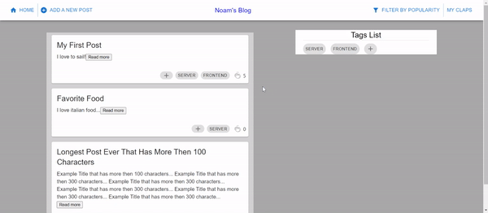

# Server-Client Blog



##  About this project
```bash

I made this project cause I wanted to learn the basics of web development.
In my blog you can add a new post to the Blog by clicking the 'Add a new Post' button.
In addition you can tag the post for a specific subject and add new tags as wanted.
```

##  Features
```bash
1. ReactJS, JavaScript, Axios.
2. Web development
3. Server Client Basics
```

